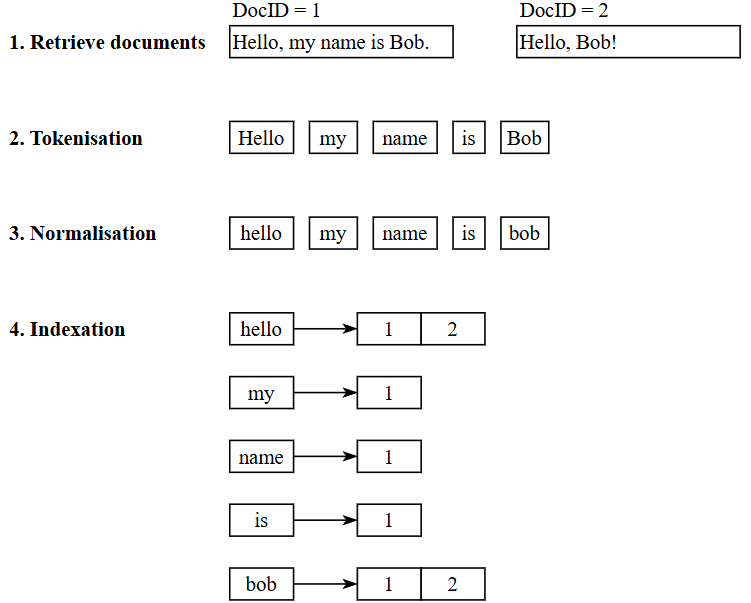
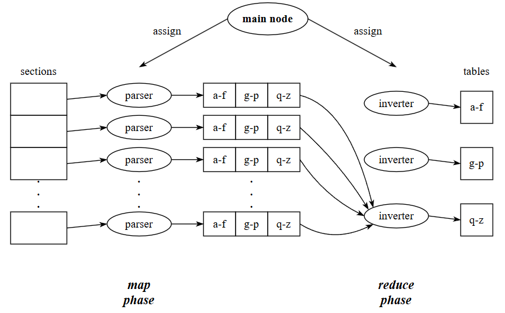
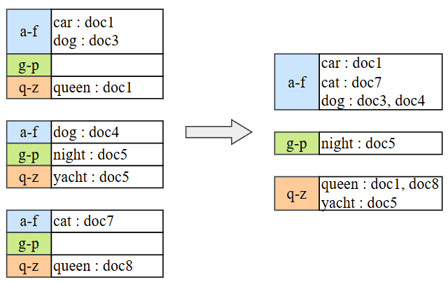
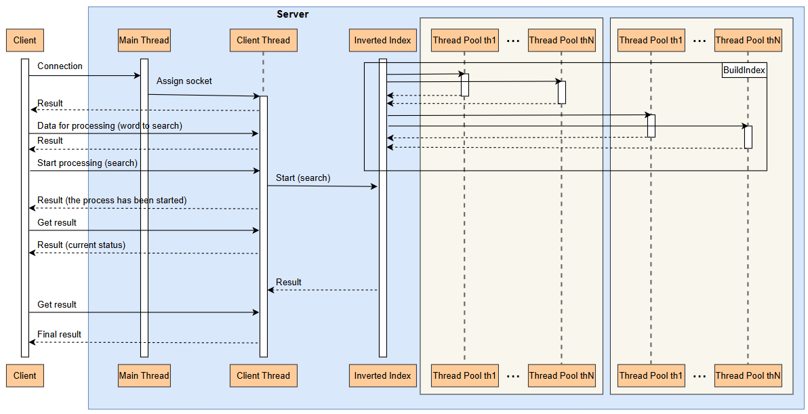

# Inverted Index Implementation
This repository contains an implementation of the Inverted Index data structure. The efficiency of building the index is achieved through parallelisation and the use of synchronisation mechanisms. The Inverted Index uses thread safe-queue, enabling integration into multithreaded and multiprocessor environments. Additionally, you can modify the amount of threads for customised parallelisation according to specific needs.

The Inverted Index is important mechanism in search systems. It allows to search documents, that have certain token. It is called "inverted" due to mapping tokens to documents, rather than other way around.

## How It Works
There are some key steps for indexation (Fig. 1):
1. Get documents for indexation;
2. Tokenise the text of each document;
3. Normalise the resulting tokens;
4. Create an index, resulting in a table of tokens and corresponding documents.

Fig. 1

The indexing process can be divided into two phases: map and reduce (Fig. 2).

Fig. 2

### Map Phase
Firstly, the entire set of documents is divided into sections by the main node. During the map phase, each parser node is assigned a section to process (tokenise, normalise) and in result each parser has table of tokens and their corresponding documents, where the token is key and the list of documents is the value.
### Reduce Phase
After that, reduce phase begins. In this phase, the generated tables are merged such that: all tokens are sorted and splited into alphabetical groups; identical tokens have their document lists merged. So, the main node assign to inverter nodes to merge tables of certain alphabetical group. The merging process is illustrated in Fig. 3.

Fig. 3

In this code, the InvertedIndex acts as the main node, managing the entire process: assigns Tasks to threads in ThreadPool; determines, which secion of data is prescribed to each thread, and manages lifecycle of the ThreadPool.

## Future Enhancements
In further implementation it is planned, that clients could query a server containing InvertedIndex for document searches by token. The communication will be based on sockets. The client will send a search request, and the ClientThread will communicate with the InvertedIndex to retrieve the results. For a clearer illustration, refer to Fig. 4.

Fig. 4

